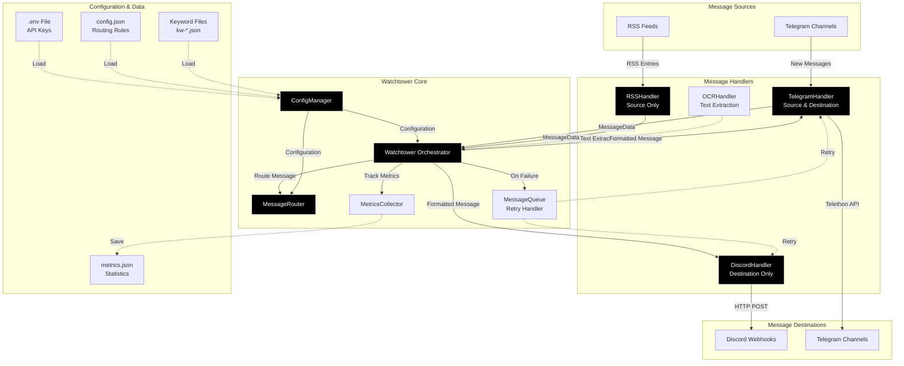

# Watchtower Architecture Overview

This document provides a high-level overview of the Watchtower architecture and its major components.

## Component Diagram

### Interactive Diagram (Mermaid)



### ASCII Diagram (Plain Text View)

```
┌─────────────────────────────────────────────────────────────────────────┐
│                          WATCHTOWER ARCHITECTURE                        │
└─────────────────────────────────────────────────────────────────────────┘

    ┌──────────────┐         ┌──────────────┐
    │  TELEGRAM    │         │  RSS FEEDS   │
    │  Channels    │         │              │
    └──────┬───────┘         └──────┬───────┘
           │                        │
           │ New Messages     RSS Entries
           │                        │
           ▼                        ▼
    ┌──────────────┐         ┌──────────────┐
    │  TELEGRAM    │         │ RSS HANDLER  │
    │  HANDLER     │◄────────┤              │
    │ (Src + Dest) │         │ (Source)     │
    └──────┬───────┘         └──────┬───────┘
           │                        │
           │ MessageData    MessageData
           │                        │
           └────────────┬───────────┘
                        │
                        ▼
           ┌────────────────────────┐
           │    WATCHTOWER CORE     │
           │  ┌──────────────────┐  │
           │  │  Watchtower      │  │◄─────── ConfigManager
           │  │  Orchestrator    │  │         (config.json, .env)
           │  └────┬─────────────┘  │
           │       │                │
           │       ├──► MessageRouter (keyword matching)
           │       ├──► MessageQueue (retry handler)
           │       ├──► MetricsCollector (statistics)
           │       └──► OCRHandler (text extraction)
           │                        │
           └────────────┬───────────┘
                        │
           ┌────────────┴───────────┐
           │                        │
           ▼                        ▼
    ┌──────────────┐         ┌──────────────┐
    │   DISCORD    │         │  TELEGRAM    │
    │   HANDLER    │         │  HANDLER     │
    │ (Destination)│         │ (Destination)│
    └──────┬───────┘         └──────┬───────┘
           │                        │
           │ HTTP POST     Telethon API
           │                        │
           ▼                        ▼
    ┌──────────────┐         ┌──────────────┐
    │   DISCORD    │         │  TELEGRAM    │
    │   Webhooks   │         │  Channels    │
    └──────────────┘         └──────────────┘

    Legend:
    ──►  Data flow
    ◄──  Configuration/control
    │    Connection
```


## Key Components

### 1. **Watchtower Orchestrator** (Central Coordinator)
- Initializes all components
- Coordinates message flow through the system
- Handles message preprocessing (OCR, URL defanging)
- Manages media downloads and cleanup
- Tracks metrics and handles shutdown

### 2. **ConfigManager** (Configuration)
- Loads `config.json` and `.env` files
- Resolves environment variables for API keys and webhooks
- Loads and caches keyword files
- Builds internal routing structures
- Handles RSS feed deduplication

### 3. **MessageRouter** (Routing Logic)
- Matches messages to destinations based on keywords
- Handles channel ID mapping
- Applies per-destination parsers (trim lines)
- Determines OCR requirements per destination

### 4. **Message Handlers**

#### TelegramHandler (Dual-Purpose)
- **As Source**: Monitors Telegram channels for new messages
- **As Destination**: Sends formatted messages to Telegram
- Handles restricted mode (file type filtering)
- Generates defanged URLs for CTI workflows

#### RSSHandler (Source Only)
- Polls RSS feeds at configured intervals
- Filters entries by age (2-day window)
- Tracks last-seen timestamps
- Converts RSS entries to MessageData

#### DiscordHandler (Destination Only)
- Sends messages to Discord webhooks via HTTP
- Formats messages with Discord markdown
- Handles rate limiting (429 responses)
- Supports media attachments

### 5. **OCRHandler** (Optional Processing)
- Extracts text from images using EasyOCR
- Used for keyword matching on screenshots
- Cached reader initialization
- Graceful degradation if library unavailable

### 6. **MessageQueue** (Reliability)
- Retry queue for failed deliveries
- Exponential backoff (5s, 10s, 20s)
- Maximum 3 retry attempts
- Background async processing

### 7. **MetricsCollector** (Monitoring)
- Tracks message counts by source and destination
- Records OCR usage, retry queue size
- Tracks application runtime
- Persists to JSON file

## Data Structures

### MessageData (Generic Container)
```python
MessageData:
    - source_type: "telegram" | "rss"
    - channel_id: str
    - channel_name: str
    - username: str
    - timestamp: datetime
    - text: str
    - has_media: bool
    - media_type: str | None
    - media_path: str | None
    - ocr_enabled: bool
    - ocr_raw: str | None
    - reply_context: dict | None
    - original_message: object
    - metadata: dict
```

### Destination Configuration
```python
{
    "name": "Destination Name",
    "type": "discord" | "telegram",
    "env_key": "WEBHOOK_ENV_VAR",
    "channels": [
        {
            "id": "@channel_name",
            "keywords": {"files": [...], "inline": [...]},
            "restricted_mode": bool,
            "parser": {"trim_front_lines": int, "trim_back_lines": int},
            "ocr": bool
        }
    ],
    "rss": [...]
}
```

## Message Flow Summary

1. **Source** receives message (Telegram/RSS)
2. **Handler** converts to MessageData
3. **Watchtower** preprocesses (OCR, URL defanging)
4. **MessageRouter** finds matching destinations
5. **Watchtower** applies parser and formats message
6. **Handler** delivers to destination (Discord/Telegram)
7. **On failure**: MessageQueue retries with backoff
8. **Finally**: Clean up media files, update metrics

## Key Design Patterns

- **Dependency Injection**: Watchtower accepts handler instances for testing
- **Abstract Base Class**: DestinationHandler provides common functionality
- **Source-Agnostic Design**: MessageData works with any source
- **Retry Pattern**: MessageQueue handles transient failures
- **Rate Limiting**: Per-destination tracking with exponential backoff
- **Graceful Degradation**: OCR optional, continues if unavailable
