# Watchtower Class Diagram

This document illustrates the class structure and relationships in the Watchtower system.

## Main Class Relationships

### ASCII Class Hierarchy

```
┌──────────────────────────────────────────────────────────────┐
│                      WATCHTOWER (Main)                       │
│  ┌────────────────────────────────────────────────────────┐  │
│  │ - config: ConfigManager                                │  │
│  │ - telegram: TelegramHandler                            │  │
│  │ - discord: DiscordHandler                              │  │
│  │ - rss: RSSHandler                                      │  │
│  │ - router: MessageRouter                                │  │
│  │ - ocr: OCRHandler                                      │  │
│  │ - message_queue: MessageQueue                          │  │
│  │ - metrics: MetricsCollector                            │  │
│  │                                                          │  │
│  │ + start() async                                         │  │
│  │ + shutdown() async                                      │  │
│  │ - _handle_message(MessageData, bool) async -> bool     │  │
│  └────────────────────────────────────────────────────────┘  │
└──────────────────────────────────────────────────────────────┘
                               │
                               │ uses
                ┌──────────────┴──────────────┐
                │                             │
                ▼                             ▼
        ┌──────────────┐              ┌──────────────┐
        │ ConfigManager│              │MessageRouter │
        │──────────────│              │──────────────│
        │+ webhooks    │              │+ routes msgs │
        │+ rss_feeds   │              │+ matches kw  │
        │+ load_config │              │+ parse_msg   │
        └──────────────┘              └──────────────┘


    ┌─────────────────────────────────────────────┐
    │       DestinationHandler (Abstract)         │
    │─────────────────────────────────────────────│
    │ - _rate_limits: Dict                        │
    │                                             │
    │ + send_message()*                           │
    │ + format_message()*                         │
    │ # _chunk_text(text, max_length) -> List    │
    │ # _store_rate_limit(dest, seconds)          │
    └──────────────┬──────────────────────────────┘
                   │
                   │ inherits
        ┌──────────┴──────────┐
        │                     │
        ▼                     ▼
┌──────────────────┐  ┌──────────────────┐
│ TelegramHandler  │  │  DiscordHandler  │
│──────────────────│  │──────────────────│
│ - client         │  │ + DISCORD_LIMIT  │
│ - channels       │  │                  │
│ + start()        │  │ + send_message() │
│ + send_copy()    │  │ + format(HTML)   │
│ + format(HTML)   │  │                  │
└──────────────────┘  └──────────────────┘
     (Dual Role:           (Destination
  Source + Destination)      Only)


         ┌──────────────┐
         │ RSSHandler   │
         │──────────────│
         │ - feeds      │
         │ + run_feed() │
         │ + poll()     │
         └──────────────┘
         (Source Only)


    ┌──────────────┐        ┌──────────────┐
    │ MessageData  │        │ MessageQueue │
    │──────────────│        │──────────────│
    │+ source_type │        │ - _queue     │
    │+ channel_id  │        │ + enqueue()  │
    │+ text        │        │ + process()  │
    │+ has_media   │        └──────────────┘
    │+ ocr_raw     │
    └──────────────┘
    (Data Container)


    ┌───────────────┐      ┌──────────────┐
    │  OCRHandler   │      │MetricsColletr│
    │───────────────│      │──────────────│
    │+ extract_text │      │+ increment() │
    │+ is_available │      │+ set()       │
    └───────────────┘      │+ get_all()   │
                           └──────────────┘


Legend:
  * = abstract method (must implement in subclass)
  # = protected method
  + = public method
  - = private attribute
  ──► = uses/depends on
  ───  = inherits from
```

### Detailed Mermaid Diagram

```mermaid
classDiagram
    %% Core Classes
    class Watchtower {
        -ConfigManager config
        -TelegramHandler telegram
        -DiscordHandler discord
        -RSSHandler rss
        -MessageRouter router
        -OCRHandler ocr
        -MessageQueue message_queue
        -MetricsCollector metrics
        -List~str~ sources
        -bool _shutdown_requested
        -float _start_time
        +__init__(sources, **handlers)
        +start() async
        +shutdown() async
        -_handle_message(message_data, is_latest) async bool
        -_preprocess_message(message_data) async
        -_handle_media_restrictions(message_data, destinations) async bool
        -_dispatch_to_destination(message_data, destination, media_passes) async bool
        -_send_to_discord(message, destination, content, include_media) async str
        -_send_to_telegram(message, destination, content, include_media) async str
        -_get_media_for_send(message, destination, include_media) str
        -_cleanup_attachments_dir()
    }

    class ConfigManager {
        -Path project_root
        -Path config_dir
        -Path tmp_dir
        -Path attachments_dir
        -str api_id
        -str api_hash
        -List~Dict~ webhooks
        -List~Dict~ rss_feeds
        -Dict~str,str~ channel_names
        -Dict~str,List~ _keyword_cache
        +__init__()
        -_load_config() Dict
        -_process_destination_config(dest_config, rss_feed_index) Dict
        -_resolve_destination_endpoint(dest_config, name, type) tuple
        -_process_channel_sources(dest_config, name) List
        -_process_rss_sources(dest_config, dest_name, channels, rss_index)
        -_load_keyword_file(filename) List
        -_resolve_keywords(keyword_config) List
        +get_all_channel_ids() Set
    }

    class MessageRouter {
        -ConfigManager config
        +__init__(config)
        +get_destinations(message_data) List~Dict~
        +is_ocr_enabled_for_channel(channel_id, channel_name) bool
        +parse_msg(message_data, parser) MessageData
        -_channel_matches(channel_id, channel_name, config_id) bool
        -_keyword_match(search_text, keywords) bool
    }

    %% Data Classes
    class MessageData {
        +str source_type
        +str channel_id
        +str channel_name
        +str username
        +datetime timestamp
        +str text
        +bool has_media
        +str media_type
        +str media_path
        +bool ocr_enabled
        +str ocr_raw
        +Dict reply_context
        +object original_message
        +Dict metadata
    }

    %% Handler Base Class
    class DestinationHandler {
        <<abstract>>
        -Dict~str,float~ _rate_limits
        #_store_rate_limit(destination_id, retry_after)
        #_check_and_wait_for_rate_limit(destination_id)
        #_chunk_text(text, max_length) List~str~
        +send_message(content, destination_id, media_path)* bool
        +format_message(message_data, destination)* str
        #_get_rate_limit_key(destination_id)* str
    }

    %% Handler Implementations
    class TelegramHandler {
        -ConfigManager config
        -TelegramClient client
        -Dict channels
        -callback msg_callback
        -int _msg_counter
        -Dict~str,int~ _dest_cache
        +TELEGRAM_CAPTION_LIMIT: int
        +TELEGRAM_MESSAGE_LIMIT: int
        +ALLOWED_MIME_TYPES: Set
        +ALLOWED_EXTENSIONS: Set
        +__init__(config)
        +start() async
        +setup_handlers(callback)
        +fetch_latest_messages() async
        +download_media(message_data) async str
        +send_message(content, dest_id, media_path) bool
        +send_copy(dest_id, content, media_path) async bool
        +format_message(message_data, destination) str
        +resolve_destination(channel_spec) async int
        +run() async
        -_resolve_entity(identifier) async
        -_resolve_channel(channel_id) async
        -_create_message_data(message, channel_id) async MessageData
        -_extract_username_from_sender(sender) str$
        -_get_media_type(media) str$
        -_get_reply_context(message) async Dict
        -_is_media_restricted(message) bool
        -_defang_tme(url) str$
        -_format_reply_context_html(reply_context) str
        +build_message_url(channel_id, username, msg_id) str$
        +build_defanged_tg_url(channel_id, username, msg_id) str$
        #_get_rate_limit_key(destination_id) str
    }

    class DiscordHandler {
        +DISCORD_MESSAGE_LIMIT: int
        +send_message(content, webhook_url, media_path) bool
        +format_message(message_data, destination) str
        -_format_reply_context_markdown(reply_context) str
        #_get_rate_limit_key(destination_id) str
    }

    class RSSHandler {
        -ConfigManager config
        -callback message_callback
        -int DEFAULT_POLL_INTERVAL
        -int MAX_ENTRY_AGE_DAYS
        -Dict~str,float~ _last_timestamps
        +__init__(config, callback)
        +run_feed(feed_config) async
        -_poll_feed(rss_url, rss_name, last_timestamp) async List
        -_process_entry(entry, url, name, last_ts, cutoff_ts) tuple
        -_convert_to_message_data(entry, url, name) MessageData
        -_parse_timestamp(entry) float
        -_strip_html(text) str
    }

    class OCRHandler {
        -Reader _ocr_reader
        -bool _EASYOCR_AVAILABLE
        +is_available() bool
        +extract_text(image_path) str
        -_ensure_reader()
    }

    %% Support Classes
    class MessageQueue {
        -deque~RetryItem~ _queue
        +enqueue(destination, content, media_path, reason)
        +process_queue(watchtower_app) async
        +get_queue_size() int
        -_should_retry(item) bool
        -_send_to_discord(item, discord_handler) async bool
        -_send_to_telegram(item, telegram_handler) async bool
    }

    class RetryItem {
        +Dict destination
        +str formatted_content
        +str media_path
        +int attempt
        +float next_retry_time
        +str reason
    }

    class MetricsCollector {
        -Path metrics_file
        -Dict~str,int~ _metrics
        +__init__(metrics_file)
        +increment(metric_name)
        +set(metric_name, value)
        +get(metric_name) int
        +get_all() Dict
    }

    %% Relationships
    Watchtower --> ConfigManager : uses
    Watchtower --> MessageRouter : uses
    Watchtower --> TelegramHandler : uses
    Watchtower --> DiscordHandler : uses
    Watchtower --> RSSHandler : uses
    Watchtower --> OCRHandler : uses
    Watchtower --> MessageQueue : uses
    Watchtower --> MetricsCollector : uses
    Watchtower ..> MessageData : processes

    MessageRouter --> ConfigManager : uses
    MessageRouter ..> MessageData : routes

    TelegramHandler --|> DestinationHandler : inherits
    DiscordHandler --|> DestinationHandler : inherits
    TelegramHandler --> ConfigManager : uses
    TelegramHandler ..> MessageData : creates/formats

    RSSHandler --> ConfigManager : uses
    RSSHandler ..> MessageData : creates

    MessageQueue --> RetryItem : contains
    MessageQueue --> TelegramHandler : retries via
    MessageQueue --> DiscordHandler : retries via

    DiscordHandler ..> MessageData : formats
    OCRHandler ..> MessageData : enhances

    %% Notes
    note for DestinationHandler "Abstract base class\nproviding rate limiting\nand text chunking"
    note for TelegramHandler "Dual purpose:\nSource AND Destination"
    note for MessageData "Source-agnostic\nmessage container"
```



## Class Responsibilities

### **Watchtower** (Orchestrator)
**Purpose**: Central coordinator for entire application

**Responsibilities**:
- Initialize all components with dependency injection
- Start/stop source handlers (Telegram, RSS)
- Coordinate message flow through routing pipeline
- Preprocess messages (OCR extraction, URL defanging)
- Handle media restrictions and downloads
- Dispatch messages to destinations
- Manage retry queue integration
- Track metrics and handle graceful shutdown
- Clean up temporary media files

**Key Design**:
- Accepts handler instances for testability
- Uses async/await for concurrent operations
- Implements try/finally for guaranteed cleanup

---

### **ConfigManager** (Configuration)
**Purpose**: Load and manage application configuration

**Responsibilities**:
- Load `config.json` and `.env` files
- Resolve environment variables for API keys
- Build webhook and RSS feed data structures
- Load and cache keyword files
- Deduplicate RSS feeds globally
- Provide channel ID access

**Key Design**:
- Keyword file caching prevents repeated reads
- Single source of truth for configuration
- Validates configuration during load

---

### **MessageRouter** (Routing Logic)
**Purpose**: Determine which destinations receive each message

**Responsibilities**:
- Match messages against destination keywords
- Handle channel ID matching (with/without -100 prefix)
- Determine OCR requirements per channel
- Apply per-destination parsers (trim lines)
- Build searchable text (message + OCR)

**Key Design**:
- Case-insensitive keyword matching
- Empty keyword list = forward all messages
- Parser returns new MessageData (immutable pattern)

---

### **MessageData** (Data Transfer Object)
**Purpose**: Source-agnostic message representation

**Responsibilities**:
- Store message content and metadata
- Support Telegram and RSS sources uniformly
- Include optional OCR and media fields
- Provide extensible metadata dict

**Key Design**:
- Dataclass for clean initialization
- Optional fields with sensible defaults
- Immutable-friendly (parsers return new instances)

---

### **DestinationHandler** (Abstract Base)
**Purpose**: Provide common destination functionality

**Responsibilities**:
- Track rate limits per destination
- Implement text chunking algorithm
- Define interface for subclasses

**Key Design**:
- Abstract methods: `send_message()`, `format_message()`, `_get_rate_limit_key()`
- Ceiling-rounds rate limit durations
- Chunks text respecting newline boundaries

---

### **TelegramHandler** (Source + Destination)
**Purpose**: Handle all Telegram operations

**Responsibilities**:
- **As Source**: Monitor channels, convert messages to MessageData
- **As Destination**: Format and send messages to Telegram
- Implement restricted mode filtering
- Generate defanged URLs for CTI
- Handle reply context extraction
- Support both public and private channels

**Key Design**:
- Uses Telethon library for Telegram API
- HTML formatting for Telegram
- Caches destination resolution
- Handles FloodWaitError for rate limits

---

### **DiscordHandler** (Destination Only)
**Purpose**: Send messages to Discord webhooks

**Responsibilities**:
- Format messages with Discord markdown
- Send HTTP POST to webhooks
- Detect rate limits (429 responses)
- Support media attachments

**Key Design**:
- Uses requests library for HTTP
- Markdown formatting (**bold**, `code`, > quotes)
- Extracts retry_after from rate limit responses

---

### **RSSHandler** (Source Only)
**Purpose**: Poll RSS feeds and convert to messages

**Responsibilities**:
- Poll feeds at configured intervals
- Filter entries by age (2-day window)
- Track last-seen timestamps
- Convert RSS entries to MessageData
- Strip HTML from content

**Key Design**:
- Async polling with asyncio.sleep
- Prevents duplicate messages via timestamp tracking
- Age filtering prevents startup floods

---

### **OCRHandler** (Optional Enhancement)
**Purpose**: Extract text from images

**Responsibilities**:
- Initialize EasyOCR reader
- Extract text from image files
- Handle missing EasyOCR gracefully

**Key Design**:
- Lazy reader initialization
- Availability check before use
- Returns None on errors

---

### **MessageQueue** (Reliability)
**Purpose**: Retry failed message deliveries

**Responsibilities**:
- Queue failed deliveries
- Calculate exponential backoff
- Retry up to 3 times
- Remove successful/expired items

**Key Design**:
- Background async processor
- Separate retry logic per destination type
- 5s/10s/20s backoff schedule

---

### **MetricsCollector** (Monitoring)
**Purpose**: Track usage statistics

**Responsibilities**:
- Increment counters (messages, OCR, retries)
- Set values (runtime)
- Persist to JSON file
- Provide metric retrieval

**Key Design**:
- Thread-safe increment/set operations
- Auto-save on each update
- Simple dict-based storage

## Inheritance Hierarchy

```
DestinationHandler (ABC)
    ├── TelegramHandler
    └── DiscordHandler
```

## Composition Relationships

**Watchtower contains**:
- 1 ConfigManager
- 1 MessageRouter
- 1 TelegramHandler
- 1 DiscordHandler
- 0-1 RSSHandler (if RSS enabled)
- 1 OCRHandler
- 1 MessageQueue
- 1 MetricsCollector

**MessageQueue contains**:
- 0-N RetryItem (in deque)

**ConfigManager contains**:
- N webhooks (List[Dict])
- N rss_feeds (List[Dict])
- Keyword cache (Dict[str, List])

## Data Flow Between Classes

1. **Source → Watchtower**
   - TelegramHandler/RSSHandler create MessageData
   - Pass to Watchtower._handle_message()

2. **Watchtower → MessageRouter**
   - Pass MessageData to get_destinations()
   - Receive list of matching destinations

3. **Watchtower → Handlers**
   - Call format_message() on DiscordHandler/TelegramHandler
   - Call send_message() to deliver

4. **Watchtower → MessageQueue**
   - Enqueue failed deliveries
   - MessageQueue calls handlers for retry

5. **Watchtower → MetricsCollector**
   - Increment counters throughout pipeline
   - Set runtime on shutdown
