# Configuration Structure

This document describes the configuration file structure and how configuration flows through the system.

## Configuration File Hierarchy

```mermaid
graph TB
    subgraph "Configuration Files"
        ENV[".env<br/>(git-ignored)<br/>API Keys & Secrets"]
        CONFIG["config.json<br/>Main Configuration"]
        KW_GEN["kw-general.json<br/>Shared Keywords"]
        KW_WORK["kw-work.json<br/>Work Keywords"]
        KW_CUSTOM["kw-*.json<br/>Custom Keyword Files"]
    end

    subgraph "Runtime Structures"
        CM[ConfigManager]
        WEBHOOKS["webhooks: List[Dict]<br/>Destination Configs"]
        RSS_FEEDS["rss_feeds: List[Dict]<br/>Deduplicated Feeds"]
        KW_CACHE["_keyword_cache: Dict<br/>Loaded Keyword Files"]
        CHANNEL_NAMES["channel_names: Dict<br/>ID → Display Name"]
    end

    ENV -->|load_dotenv| CM
    CONFIG -->|json.load| CM
    KW_GEN -->|on demand| CM
    KW_WORK -->|on demand| CM
    KW_CUSTOM -->|on demand| CM

    CM -->|builds| WEBHOOKS
    CM -->|builds| RSS_FEEDS
    CM -->|caches| KW_CACHE
    CM -->|populates| CHANNEL_NAMES

    style ENV fill:#ffe6e6
    style CONFIG fill:#e6f2ff
    style KW_GEN fill:#e6ffe6
    style WEBHOOKS fill:#fff2e6
    style RSS_FEEDS fill:#fff2e6
```



## config.json Structure


## Example Configuration

### Minimal config.json

```json
{
  "destinations": [
    {
      "name": "CTI Feed",
      "type": "discord",
      "env_key": "DISCORD_WEBHOOK_CTI",
      "channels": [
        {
          "id": "@threat_intel_channel",
          "keywords": {
            "files": ["kw-general.json"],
            "inline": ["apt", "malware", "breach"]
          },
          "restricted_mode": false,
          "parser": {
            "trim_front_lines": 0,
            "trim_back_lines": 0
          },
          "ocr": false
        }
      ]
    }
  ]
}
```

### Complete config.json Example

```json
{
  "destinations": [
    {
      "name": "General Threat Intel",
      "type": "discord",
      "env_key": "DISCORD_WEBHOOK_GENERAL",
      "channels": [
        {
          "id": "@global_threats",
          "keywords": {
            "files": ["kw-general.json"],
            "inline": []
          },
          "restricted_mode": false,
          "parser": {
            "trim_front_lines": 0,
            "trim_back_lines": 0
          },
          "ocr": true
        },
        {
          "id": "-1001234567890",
          "keywords": {
            "files": [],
            "inline": ["cve", "0day", "exploit"]
          },
          "restricted_mode": true,
          "parser": {
            "trim_front_lines": 2,
            "trim_back_lines": 1
          },
          "ocr": false
        }
      ],
      "rss": [
        {
          "url": "https://feeds.feedburner.com/TheHackersNews",
          "name": "The Hacker News",
          "keywords": {
            "inline": ["breach", "vulnerability", "cyberattack"]
          }
        }
      ]
    },
    {
      "name": "Work CTI",
      "type": "telegram",
      "env_key": "TELEGRAM_WORK_CHANNEL",
      "channels": [
        {
          "id": "@industry_threats",
          "keywords": {
            "files": ["kw-work.json", "kw-general.json"],
            "inline": []
          },
          "restricted_mode": false,
          "parser": null,
          "ocr": true
        }
      ],
      "rss": [
        {
          "url": "https://www.cisa.gov/news.xml",
          "name": "CISA Alerts",
          "keywords": {
            "files": ["kw-work.json"],
            "inline": []
          },
          "parser": {
            "trim_front_lines": 1,
            "trim_back_lines": 0
          }
        }
      ]
    }
  ]
}
```

### .env File Example

```bash
# Telegram API Credentials
TELEGRAM_API_ID=12345678
TELEGRAM_API_HASH=abcdef1234567890abcdef1234567890

# Discord Webhooks
DISCORD_WEBHOOK_GENERAL=https://discord.com/api/webhooks/123456789/abcdefg
DISCORD_WEBHOOK_CTI=https://discord.com/api/webhooks/987654321/hijklmn

# Telegram Destination Channels
TELEGRAM_WORK_CHANNEL=@my_work_channel
TELEGRAM_PERSONAL_CHANNEL=-1001234567890

# Optional: Config file override
CONFIG_FILE=config.json
```

### Keyword File Example (kw-general.json)

```json
{
  "keywords": [
    "ransomware",
    "apt",
    "malware",
    "phishing",
    "breach",
    "0day",
    "exploit",
    "vulnerability",
    "cve-",
    "threat actor",
    "backdoor",
    "c2",
    "command and control"
  ]
}
```

## Configuration Loading Flow


## Configuration Field Reference

### Destination Object

| Field | Type | Required | Description |
|-------|------|----------|-------------|
| `name` | string | Yes | Human-readable destination name |
| `type` | string | Yes | `"discord"` or `"telegram"` |
| `env_key` | string | Yes | Environment variable name containing webhook URL or channel ID |
| `channels` | array | No | List of Telegram channels to monitor (can be empty for RSS-only) |
| `rss` | array | No | List of RSS feeds to monitor (optional) |

### Channel Object

| Field | Type | Required | Default | Description |
|-------|------|----------|---------|-------------|
| `id` | string | Yes | - | Channel identifier: `@username` or numeric ID |
| `keywords` | object | No | `{}` | Keyword configuration (files + inline) |
| `restricted_mode` | boolean | No | `false` | Enable file type filtering for security |
| `parser` | object/null | No | `null` | Line trimming configuration |
| `ocr` | boolean | No | `false` | Enable OCR text extraction |

### Keywords Object

| Field | Type | Required | Default | Description |
|-------|------|----------|---------|-------------|
| `files` | array | No | `[]` | List of keyword file names to load |
| `inline` | array | No | `[]` | List of keywords defined directly in config |

**Note**: Empty keywords object `{}` or omitted keywords = forward ALL messages from that channel.

### Parser Object

| Field | Type | Required | Default | Description |
|-------|------|----------|---------|-------------|
| `trim_front_lines` | number | No | `0` | Number of lines to remove from beginning |
| `trim_back_lines` | number | No | `0` | Number of lines to remove from end |

**Use Case**: Remove repetitive headers/footers from RSS feeds or channel messages.

### RSS Object

| Field | Type | Required | Default | Description |
|-------|------|----------|---------|-------------|
| `url` | string | Yes | - | RSS/Atom feed URL |
| `name` | string | Yes | - | Human-readable feed name |
| `keywords` | object | No | `{}` | Keyword configuration (same as channel keywords) |
| `parser` | object/null | No | `null` | Line trimming configuration (optional) |

## Configuration Best Practices

### 1. **Use Keyword Files for Shared Lists**
```json
{
  "keywords": {
    "files": ["kw-general.json"],
    "inline": ["specific-term"]
  }
}
```
- Share common keywords across channels via files
- Use inline for channel-specific additions
- Files are cached, reducing duplicate memory usage

### 2. **Restricted Mode for Untrusted Sources**
```json
{
  "id": "@public_threat_channel",
  "restricted_mode": true,
  "ocr": false
}
```
- Enable for public channels with unknown actors
- Blocks photos, videos, executables
- Only allows: .txt, .csv, .log, .sql, .xml, .dat, .db, .mdb, .json
- **Security**: Both extension AND MIME type must match

### 3. **OCR for Screenshot-Heavy Channels**
```json
{
  "id": "@screenshot_feed",
  "ocr": true,
  "keywords": {
    "inline": ["check", "invoice", "document"]
  }
}
```
- Extract text from images for keyword matching
- Useful for channels posting screenshots
- Adds 1-3 second processing delay

### 4. **Parser for Noisy RSS Feeds**
```json
{
  "url": "https://example.com/feed.xml",
  "name": "Example Feed",
  "parser": {
    "trim_front_lines": 2,
    "trim_back_lines": 1
  }
}
```
- Remove consistent headers/footers
- Reduces noise in forwarded messages
- Applies to all destinations receiving this feed

### 5. **Environment Variables for Secrets**
```bash
# .env file (git-ignored)
DISCORD_WEBHOOK_PROD=https://discord.com/api/webhooks/...
DISCORD_WEBHOOK_TEST=https://discord.com/api/webhooks/...
```
- Never commit API keys or webhooks
- Use descriptive env var names
- Separate prod/test/dev webhooks

### 6. **RSS Feed Deduplication**
```json
{
  "destinations": [
    {
      "name": "Dest A",
      "rss": [
        {"url": "https://feed.com/news.xml", "name": "News"}
      ]
    },
    {
      "name": "Dest B",
      "rss": [
        {"url": "https://feed.com/news.xml", "name": "News"}
      ]
    }
  ]
}
```
- Same RSS URL is polled ONCE globally
- Routed to both destinations with per-destination keywords
- Saves bandwidth and reduces feed server load

## Configuration Validation

ConfigManager validates configuration during load:

1. **Required Fields**: Checks `name`, `type`, `env_key` exist
2. **Type Validation**: Ensures `type` is "discord" or "telegram"
3. **Environment Variables**: Warns if env_key not found in environment
4. **Channel Structure**: Validates `id` field exists in channels
5. **Keyword Files**: Validates JSON structure with `"keywords"` array
6. **Keyword Types**: Ensures all keywords are strings
7. **RSS URLs**: Validates `url` and `name` fields exist

**Errors**: Invalid config stops application startup with descriptive error message.

## Configuration Updates

To update configuration:

1. Edit `config.json` or keyword files
2. Restart Watchtower application
3. **No hot-reload**: Configuration only loaded at startup

For `.env` changes:
1. Edit `.env` file
2. Restart application
3. New API keys/webhooks will be loaded
