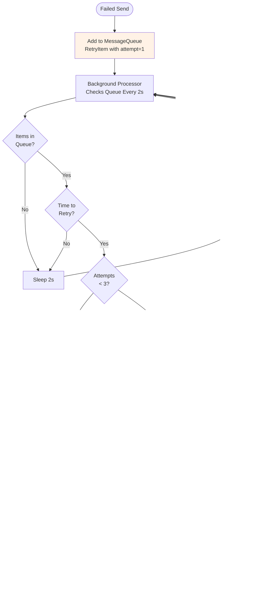

# Watchtower Data Flow Diagram

This document illustrates the detailed flow of messages through the Watchtower system.

## End-to-End Message Flow

```mermaid
flowchart TD
    Start([New Message Event])
    Start --> Source{Source Type?}

    %% Telegram Source Flow
    Source -->|Telegram| TG_Event[TelegramHandler<br/>NewMessage Event]
    TG_Event --> TG_Convert[Convert to MessageData<br/>Extract: text, sender, media type<br/>Get reply context if present]

    %% RSS Source Flow
    Source -->|RSS| RSS_Poll[RSSHandler<br/>Poll Feed Every 5 min]
    RSS_Poll --> RSS_Filter{Entry Age<br/><2 days?}
    RSS_Filter -->|Yes| RSS_New{Newer than<br/>last seen?}
    RSS_Filter -->|No| RSS_Skip[Skip - Too Old]
    RSS_New -->|Yes| RSS_Convert[Convert to MessageData<br/>Strip HTML from content]
    RSS_New -->|No| RSS_Dup[Skip - Duplicate]

    %% Convergence Point
    TG_Convert --> MD[MessageData Object]
    RSS_Convert --> MD

    %% Connection Proof Check
    MD --> Latest{is_latest flag?}
    Latest -->|Yes| ConnProof[Log Connection Proof<br/>Do Not Route]
    Latest -->|No| Metrics1[Increment:<br/>messages_received_telegram<br/>or messages_received_rss]
    ConnProof --> End([End])

    %% Preprocessing
    Metrics1 --> PreProcess[Preprocessing]

    %% OCR Branch
    PreProcess --> OCR_Check{Has Media<br/>& OCR Enabled?}
    OCR_Check -->|Yes| OCR_Download[Download Media<br/>to tmp/attachments/]
    OCR_Check -->|No| Defang
    OCR_Download --> OCR_Extract[OCRHandler<br/>Extract Text]
    OCR_Extract --> OCR_Add[Add to<br/>message_data.ocr_raw]
    OCR_Add --> Metrics_OCR[Increment:<br/>ocr_processed]
    Metrics_OCR --> Defang

    %% URL Defanging
    Defang{Source is<br/>Telegram?}
    Defang -->|Yes| DefangURL[Build Defanged URL<br/>hxxps://t[.]me/...]
    Defang -->|No| Route
    DefangURL --> AddURL[Add to metadata:<br/>src_url_defanged]
    AddURL --> Route

    %% Routing
    Route[MessageRouter.<br/>get_destinations]
    Route --> Match{Match<br/>Keywords?}
    Match -->|No Match| NoDestLog[Log: No Destinations<br/>Increment: messages_no_destination]
    Match -->|Matched| DestList[List of Matching<br/>Destinations]
    NoDestLog --> Cleanup

    %% Media Restrictions
    DestList --> RestrictCheck{Any destination<br/>has restricted_mode?}
    RestrictCheck -->|Yes| RestrictFilter[TelegramHandler.<br/>_is_media_restricted]
    RestrictCheck -->|No| ShouldDownload
    RestrictFilter --> RestrictResult{Allowed<br/>file type?}
    RestrictResult -->|No| MediaBlocked[Mark: Media Blocked]
    RestrictResult -->|Yes| ShouldDownload
    MediaBlocked --> ShouldDownload

    ShouldDownload{Should download<br/>media for any dest?}
    ShouldDownload -->|Yes| DownloadMedia[Download Media<br/>if not already downloaded]
    ShouldDownload -->|No| DispatchLoop
    DownloadMedia --> DispatchLoop

    %% Dispatch Loop
    DispatchLoop[For Each Destination]
    DispatchLoop --> Parser[Apply Parser<br/>trim_front_lines<br/>trim_back_lines]
    Parser --> Format{Destination<br/>Type?}

    %% Discord Formatting
    Format -->|Discord| DiscordFormat[DiscordHandler.<br/>format_message<br/>Markdown: **bold** `code`]
    DiscordFormat --> DiscordInclude{Include<br/>media?}
    DiscordInclude -->|No + Restricted| DiscordNote[Add note:<br/>Media filtered]
    DiscordInclude --> DiscordSend[DiscordHandler.<br/>send_message]
    DiscordNote --> DiscordSend

    DiscordSend --> DiscordResult{HTTP<br/>Status?}
    DiscordResult -->|200/204| DiscordSuccess[Increment:<br/>messages_sent_discord]
    DiscordResult -->|429| DiscordQueue[Enqueue for Retry<br/>Increment: messages_queued_retry]
    DiscordResult -->|Other| DiscordQueue

    %% Telegram Formatting
    Format -->|Telegram| TelegramFormat[TelegramHandler.<br/>format_message<br/>HTML: &lt;b&gt; &lt;code&gt; &lt;blockquote&gt;]
    TelegramFormat --> TelegramResolve[Resolve Destination<br/>@username or numeric ID]
    TelegramResolve --> TelegramSend[TelegramHandler.<br/>send_copy<br/>Chunk if > 4096 chars]

    TelegramSend --> TelegramResult{Send<br/>Success?}
    TelegramResult -->|True| TelegramSuccess[Increment:<br/>messages_sent_telegram]
    TelegramResult -->|False| TelegramQueue[Enqueue for Retry<br/>Increment: messages_queued_retry]

    %% Convergence
    DiscordSuccess --> NextDest{More<br/>Destinations?}
    DiscordQueue --> NextDest
    TelegramSuccess --> NextDest
    TelegramQueue --> NextDest

    NextDest -->|Yes| DispatchLoop
    NextDest -->|No| FinalMetrics

    %% Final Metrics
    FinalMetrics{Any<br/>Success?}
    FinalMetrics -->|Yes| MetricsSuccess[Increment:<br/>messages_routed_success]
    FinalMetrics -->|No| MetricsFailed[Increment:<br/>messages_routed_failed]

    MetricsSuccess --> Cleanup
    MetricsFailed --> Cleanup

    %% Cleanup
    Cleanup[Cleanup: Delete<br/>Downloaded Media File<br/>from tmp/attachments/]
    Cleanup --> End

    %% Skip paths
    RSS_Skip --> End
    RSS_Dup --> End

    %% Styling
    style MD fill:#e6f2ff
    style Route fill:#e6ffe6
    style DiscordFormat fill:#fff2e6
    style TelegramFormat fill:#fff2e6
    style OCR_Extract fill:#ffffee
    style Cleanup fill:#ffe6e6
```

## Message Queue Retry Flow



## Key Decision Points

### 1. **OCR Trigger**
- Only for Telegram sources with media
- Only if at least one destination has `"ocr": true`
- Downloads media if not already downloaded

### 2. **Restricted Mode Filter**
- Only applies to Telegram source media
- Checks both file extension AND MIME type
- Allowed types: .txt, .csv, .log, .sql, .xml, .dat, .db, .mdb, .json
- Both checks must pass for media to be forwarded

### 3. **Keyword Matching**
- Case-insensitive search
- Empty keyword list = forward all messages
- Searches in: message text + OCR text (if available)
- Must match at least one keyword to route

### 4. **Media Download Timing**
- Downloaded once if any destination needs it
- Downloaded for OCR even if destinations block media
- Cached for all destinations to use
- Always cleaned up in finally block

### 5. **Retry Queue Conditions**
- Discord: HTTP 429 (rate limit) or connection errors
- Telegram: FloodWaitError or API failures
- Maximum 3 attempts with exponential backoff
- Messages dropped after 3 failures

## Performance Characteristics

- **RSS Polling**: Every 5 minutes (configurable)
- **Retry Check**: Every 2 seconds
- **OCR Caching**: Reader initialized once and reused
- **Keyword Cache**: Keyword files loaded once and cached
- **Destination Resolution**: Cached per destination to avoid repeated API calls

## Error Handling

- **Connection Proof Failures**: Logged but don't stop startup
- **OCR Failures**: Logged, continue without OCR text
- **Send Failures**: Enqueued for retry, metrics tracked
- **Media Download Failures**: Logged, message sent without media
- **Cleanup Failures**: Logged as warnings, don't affect delivery
