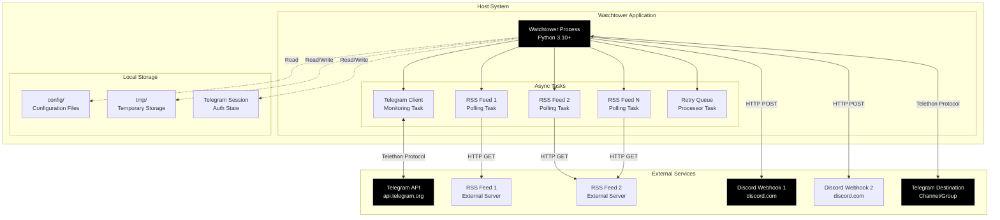

# Deployment & Directory Structure

This document describes the project directory structure and deployment architecture.

## Project Directory Structure

```mermaid
graph TB
    ROOT[Watchtower/]

    ROOT --> SRC[src/]
    ROOT --> TESTS[tests/]
    ROOT --> CONFIG[config/]
    ROOT --> TMP[tmp/]
    ROOT --> DOCS[docs/]
    ROOT --> ROOT_FILES[Root Files]

    %% Source Files
    SRC --> WT_PY[Watchtower.py<br/>Main orchestrator]
    SRC --> CFG_PY[ConfigManager.py<br/>Configuration]
    SRC --> MR_PY[MessageRouter.py<br/>Routing logic]
    SRC --> MD_PY[MessageData.py<br/>Data structure]
    SRC --> TGH_PY[TelegramHandler.py<br/>Telegram ops]
    SRC --> DH_PY[DiscordHandler.py<br/>Discord webhooks]
    SRC --> RSSH_PY[RSSHandler.py<br/>RSS polling]
    SRC --> OCR_PY[OCRHandler.py<br/>OCR extraction]
    SRC --> DEST_PY[DestinationHandler.py<br/>Base class]
    SRC --> MQ_PY[MessageQueue.py<br/>Retry queue]
    SRC --> MC_PY[MetricsCollector.py<br/>Statistics]
    SRC --> LOG_PY[logger_setup.py<br/>Logging config]

    %% Test Files
    TESTS --> TEST_CFG[test_config.py]
    TESTS --> TEST_MR[test_message_router.py]
    TESTS --> TEST_DH[test_destination_handler.py]
    TESTS --> TEST_DISCORD[test_discord_handler.py]
    TESTS --> TEST_TG[test_telegram_handler.py]
    TESTS --> TEST_OCR[test_ocr_handler.py]
    TESTS --> TEST_RSS[test_rss_handler.py]
    TESTS --> TEST_MQ[test_message_queue.py]
    TESTS --> TEST_INT[test_integration_*.py]
    TESTS --> TEST_IMG[test-img.jpg<br/>OCR test image]

    %% Config Files
    CONFIG --> ENV[".env<br/>API keys - git-ignored"]
    CONFIG --> JSON[config.json<br/>Main config]
    CONFIG --> KW_FILES[kw-*.json<br/>Keyword files]
    CONFIG --> SESSION["watchtower_session.session<br/>Telegram session - git-ignored"]

    %% Temp Files
    TMP --> ATTACH[attachments/<br/>Downloaded media]
    TMP --> METRICS_JSON[metrics.json<br/>Statistics]

    %% Documentation
    DOCS --> ARCH[architecture-overview.md]
    DOCS --> FLOW[data-flow.md]
    DOCS --> CLASS[class-diagram.md]
    DOCS --> SEQ[message-processing-sequence.md]
    DOCS --> CFG_DOC[configuration-structure.md]
    DOCS --> DEPLOY[deployment-structure.md]

    %% Root Files
    ROOT_FILES --> GITIGNORE[.gitignore]
    ROOT_FILES --> README[README.md]
    ROOT_FILES --> REQS[requirements.txt]

    style SRC fill:#000,stroke:#fff,color:#fff
    style TESTS fill:#000,stroke:#fff,color:#fff
    style CONFIG fill:#000,stroke:#fff,color:#fff
    style TMP fill:#000,stroke:#fff,color:#fff
    style DOCS fill:#000,stroke:#fff,color:#fff
```



## File Descriptions

### Source Files (src/)

| File | Lines | Purpose |
|------|-------|---------|
| `Watchtower.py` | 751 | Main orchestrator, CLI entry point, message processing pipeline |
| `ConfigManager.py` | 360 | Load config.json, .env, keyword files; build routing structures |
| `MessageRouter.py` | ~200 | Keyword matching, channel mapping, parser application |
| `MessageData.py` | ~50 | Dataclass for source-agnostic message representation |
| `TelegramHandler.py` | 503 | Telegram source monitoring & destination delivery |
| `DiscordHandler.py` | ~150 | Discord webhook delivery with markdown formatting |
| `RSSHandler.py` | ~200 | RSS feed polling and entry processing |
| `OCRHandler.py` | ~100 | EasyOCR integration for text extraction from images |
| `DestinationHandler.py` | ~100 | Abstract base class for rate limiting and chunking |
| `MessageQueue.py` | ~150 | Retry queue with exponential backoff |
| `MetricsCollector.py` | ~100 | Usage statistics tracking and JSON persistence |
| `logger_setup.py` | ~20 | Centralized logging configuration |

### Test Files (tests/)

| File | Tests | Coverage |
|------|-------|----------|
| `test_config.py` | Configuration loading, env vars, keyword files |
| `test_message_router.py` | Keyword matching, channel mapping, parser |
| `test_destination_handler.py` | Rate limiting, text chunking, order preservation |
| `test_discord_handler.py` | Discord formatting, webhook sending |
| `test_telegram_handler.py` | Telegram formatting, restricted mode, URL defanging |
| `test_ocr_handler.py` | OCR availability, text extraction |
| `test_rss_handler.py` | RSS polling, age filtering, HTML stripping |
| `test_message_queue.py` | Retry logic, exponential backoff |
| `test_message_data.py` | MessageData creation, field validation |
| `test_metrics.py` | Metric increment/set, JSON persistence |
| `test_integration_*.py` | End-to-end pipeline flows |
| `test-img.jpg` | Sample image for OCR integration tests |

### Configuration Files (config/)

| File | Purpose | Git |
|------|---------|-----|
| `.env` | API keys, webhook URLs, secrets | **Ignored** |
| `config.json` | Main configuration: destinations, channels, RSS feeds | Committed |
| `kw-*.json` | Keyword files for filtering | Committed |
| `watchtower_session.session` | Telethon session file (auth state) | **Ignored** |

### Temporary Files (tmp/)

| Path | Purpose | Cleanup |
|------|---------|---------|
| `tmp/attachments/` | Downloaded media files during processing | Deleted after routing |
| `tmp/metrics.json` | Persistent metrics across restarts | Retained |

### Documentation Files (docs/)

| File | Content |
|------|---------|
| `architecture-overview.md` | Component diagram, key design patterns |
| `data-flow.md` | End-to-end message flow, retry flow |
| `class-diagram.md` | Class relationships, responsibilities |
| `message-processing-sequence.md` | Sequence diagrams for Telegram/RSS/retry |
| `configuration-structure.md` | Config format, examples, best practices |
| `deployment-structure.md` | This file - directory structure, deployment |

## Deployment Architecture



## Network Communications

### Inbound Connections
**None** - Watchtower does not accept inbound connections. It's a client-only application.

### Outbound Connections

| Service | Protocol | Purpose | Frequency |
|---------|----------|---------|-----------|
| Telegram API | HTTPS (Telethon) | Monitor channels, send messages | Persistent connection + per message |
| RSS Feeds | HTTP/HTTPS | Poll for new entries | Every 5 minutes per feed |
| Discord Webhooks | HTTPS | POST formatted messages | Per message |

### Port Requirements
- **No inbound ports** required
- **Outbound HTTPS (443)** required for all external services
- **No firewall configuration** needed (client-only)

## Resource Requirements

### Minimum Requirements
- **CPU**: 1 core (single-threaded async operations)
- **RAM**: 256 MB (no OCR) / 1 GB (with OCR via EasyOCR)
- **Disk**: 100 MB (application) + storage for media during processing
- **Python**: 3.10 or higher

### Typical Resource Usage
- **CPU**: < 5% idle, 10-30% during OCR processing
- **RAM**:
  - Base: ~50 MB
  - With Telegram client: ~100 MB
  - With EasyOCR loaded: ~800 MB (GPU models)
- **Network**:
  - Telegram: ~1 KB per message
  - Discord: ~2 KB per message
  - RSS: ~10-100 KB per feed poll
  - Media downloads: Variable (images ~100 KB - 5 MB)

### Scaling Considerations
- **Concurrent sources**: No limit, each runs as async task
- **Message throughput**: 10-100 messages/second (limited by destination rate limits)
- **RSS feeds**: Recommended < 50 feeds (5 min intervals)
- **Destinations**: No limit, linear scaling

## Installation & Setup

### 1. Clone Repository
```bash
git clone https://github.com/your-org/Watchtower.git
cd Watchtower
```

### 2. Install Dependencies
```bash
pip install -r requirements.txt
```

**Required Dependencies**:
- `telethon` - Telegram client library
- `requests` - HTTP requests for Discord webhooks
- `feedparser` - RSS feed parsing
- `python-dotenv` - Environment variable loading
- `easyocr` (optional) - OCR text extraction

### 3. Configure

#### Create config.json
```bash
cp config/config.example.json config/config.json
# Edit config.json with your destinations and channels
```

#### Create .env
```bash
touch config/.env
# Add your API keys:
# TELEGRAM_API_ID=...
# TELEGRAM_API_HASH=...
# DISCORD_WEBHOOK_...=...
```

#### Create Keyword Files (Optional)
```bash
cat > config/kw-general.json <<EOF
{
  "keywords": ["ransomware", "malware", "breach"]
}
EOF
```

### 4. Authenticate Telegram

First run will prompt for phone number and 2FA code:
```bash
python3 src/Watchtower.py monitor --sources telegram
# Enter phone number: +1234567890
# Enter code: 12345
```

Session saved to `config/watchtower_session.session` for future runs.

### 5. Run Application

**Monitor all sources**:
```bash
python3 src/Watchtower.py monitor --sources all
```

**Monitor Telegram only**:
```bash
python3 src/Watchtower.py monitor --sources telegram
```

**Monitor RSS only**:
```bash
python3 src/Watchtower.py monitor --sources rss
```

**Discover available channels**:
```bash
python3 src/Watchtower.py discover --diff
python3 src/Watchtower.py discover --generate
```

## Running as a Service

### systemd Service (Linux)

Create `/etc/systemd/system/watchtower.service`:

```ini
[Unit]
Description=Watchtower CTI Message Router
After=network-online.target
Wants=network-online.target

[Service]
Type=simple
User=watchtower
WorkingDirectory=/opt/Watchtower
ExecStart=/usr/bin/python3 /opt/Watchtower/src/Watchtower.py monitor --sources all
Restart=on-failure
RestartSec=10
StandardOutput=journal
StandardError=journal

[Install]
WantedBy=multi-user.target
```

**Enable and start**:
```bash
sudo systemctl daemon-reload
sudo systemctl enable watchtower
sudo systemctl start watchtower
sudo systemctl status watchtower
```

**View logs**:
```bash
sudo journalctl -u watchtower -f
```

### Docker Deployment

**Dockerfile** (example):
```dockerfile
FROM python:3.10-slim

WORKDIR /app

COPY requirements.txt .
RUN pip install --no-cache-dir -r requirements.txt

COPY src/ ./src/
COPY config/ ./config/

CMD ["python", "src/Watchtower.py", "monitor", "--sources", "all"]
```

**docker-compose.yml**:
```yaml
version: '3.8'

services:
  watchtower:
    build: .
    volumes:
      - ./config:/app/config
      - ./tmp:/app/tmp
    environment:
      - TZ=UTC
    restart: unless-stopped
```

## Backup & Recovery

### Files to Backup

**Critical** (required for operation):
- `config/config.json` - Main configuration
- `config/kw-*.json` - Keyword files
- `config/.env` - API keys and secrets

**Important** (avoids re-authentication):
- `config/watchtower_session.session` - Telegram session

**Optional** (can be regenerated):
- `tmp/metrics.json` - Usage statistics

### Backup Strategy
```bash
# Backup critical config
tar czf watchtower-config-$(date +%Y%m%d).tar.gz \
    config/config.json \
    config/kw-*.json \
    config/.env \
    config/*.session
```

### Recovery
```bash
# Restore from backup
tar xzf watchtower-config-20250115.tar.gz
# Restart application
systemctl restart watchtower
```

## Monitoring & Logs

### Log Locations
- **systemd**: `journalctl -u watchtower`
- **Docker**: `docker-compose logs -f watchtower`
- **Direct run**: stdout/stderr

### Log Levels
- **INFO**: Normal operations, message routing
- **WARNING**: Configuration issues, failed retries
- **ERROR**: Unexpected failures, exceptions
- **DEBUG**: Detailed tracing (not enabled by default)

### Metrics File
Location: `tmp/metrics.json`

**Example**:
```json
{
  "messages_received_telegram": 150,
  "messages_received_rss": 45,
  "messages_routed_success": 180,
  "messages_routed_failed": 15,
  "messages_sent_discord": 120,
  "messages_sent_telegram": 60,
  "ocr_processed": 30,
  "time_ran": 3600
}
```

### Health Monitoring

**Check process status**:
```bash
systemctl status watchtower
# or
docker-compose ps
```

**Monitor metrics**:
```bash
cat tmp/metrics.json | jq .
```

**Check retry queue**:
```bash
# Look for "Retry queue size" in logs
journalctl -u watchtower | grep "queue size"
```

## Security Considerations

### Secrets Management
- **Never commit** `.env` or `.session` files
- Use environment variables for all secrets
- Rotate API keys periodically
- Use separate webhooks for prod/test

### File Permissions
```bash
chmod 600 config/.env
chmod 600 config/*.session
chmod 755 src/
chmod 644 src/*.py
```

### Network Security
- Application only makes **outbound** connections
- No exposed ports or services
- Consider firewall rules for allowed destinations
- Use HTTPS for all external services

### Restricted Mode
- Enable `restricted_mode: true` for untrusted sources
- Blocks executable files, photos, videos
- Only allows: .txt, .csv, .log, .sql, .xml, .dat, .db, .mdb, .json
- Checks both file extension AND MIME type

## Troubleshooting

### Common Issues

**Telegram authentication fails**:
- Delete `config/watchtower_session.session`
- Run again and re-authenticate

**Discord webhook 404**:
- Verify webhook URL in `.env`
- Check webhook hasn't been deleted in Discord

**RSS feed not updating**:
- Check feed URL is accessible
- Verify age filter (entries must be < 2 days old)
- Check keywords match feed content

**OCR not working**:
- Install EasyOCR: `pip install easyocr`
- First run downloads models (~100 MB)
- Check GPU drivers if using CUDA

**High memory usage**:
- Disable OCR if not needed (`"ocr": false`)
- Reduce number of concurrent RSS feeds
- Check for media file cleanup (should auto-delete)

### Debug Mode

Enable verbose logging:
```python
# In logger_setup.py
logging.basicConfig(
    format='%(asctime)s - %(levelname)s - %(message)s',
    level=logging.DEBUG  # Changed from INFO
)
```
