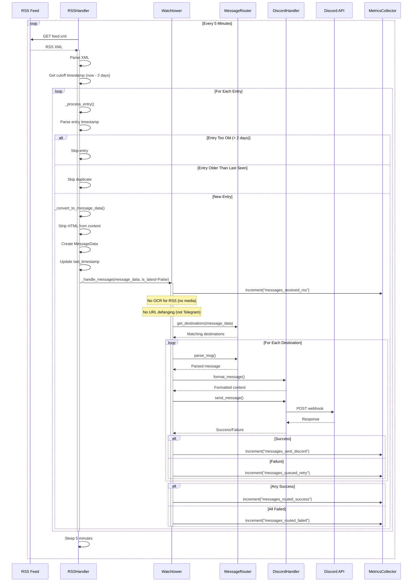
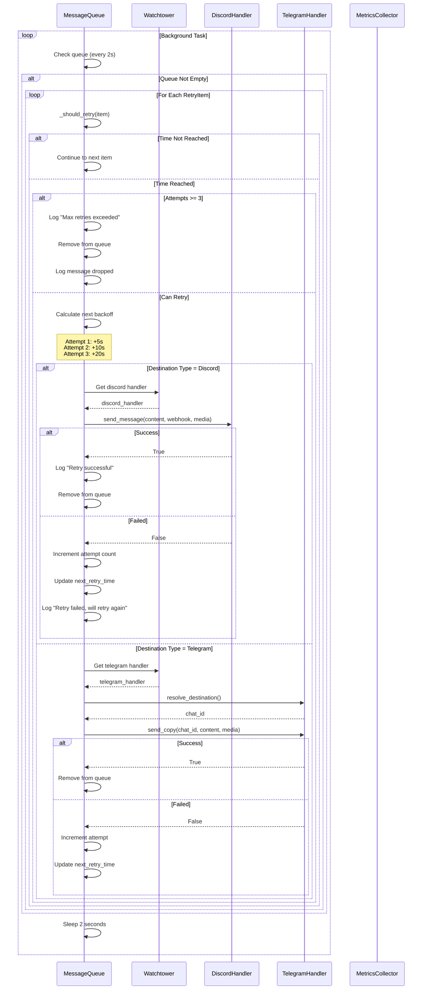

# Message Processing Sequence Diagram

This document shows the detailed sequence of operations when processing a message from source to destination.

## Telegram Message Processing Sequence

### ASCII Sequence Diagram (Simplified)

```
Telegram    Telegram    Watchtower    OCR       Message    Discord    Discord
  API       Handler                  Handler    Router     Handler      API
   │            │            │          │          │          │          │
   ├─Message───►│            │          │          │          │          │
   │            ├─Extract────┤          │          │          │          │
   │            │  sender    │          │          │          │          │
   │            │  & media   │          │          │          │          │
   │            │            │          │          │          │          │
   │            ├─Create─────┤          │          │          │          │
   │            │ MessageData│          │          │          │          │
   │            │            │          │          │          │          │
   │            └──Forward───►          │          │          │          │
   │                         │          │          │          │          │
   │                  [PREPROCESSING]   │          │          │          │
   │                         │          │          │          │          │
   │                  ┌──OCR enabled?   │          │          │          │
   │                  │      └─Yes──────►          │          │          │
   │                  │                 │          │          │          │
   │                  │      ┌─Extract──┤          │          │          │
   │                  │      │  text    │          │          │          │
   │                  │      └──────────►          │          │          │
   │                  │   Add OCR text  │          │          │          │
   │                  │                 │          │          │          │
   │                  │      [ROUTING]  │          │          │          │
   │                  │                 │          │          │          │
   │                  └─────Match────────────────►  │          │          │
   │                         │          │  keywords │          │          │
   │                         │          │  return   │          │          │
   │                         │          │   dests   │          │          │
   │                         │◄─────────────────────┤          │          │
   │                         │          │          │          │          │
   │                  [FORMATTING & DISPATCH]       │          │          │
   │                         │          │          │          │          │
   │                         ├─Apply────┤          │          │          │
   │                         │  parser  │          │          │          │
   │                         │          │          │          │          │
   │                         └─────Format─────────────────────►          │
   │                         │          │          │  Markdown │          │
   │                         │          │          │  headers  │          │
   │                         │          │          │  & code   │          │
   │                         │          │          │          │          │
   │                         └─────Send────────────────────────┴─POST────►
   │                         │          │          │          │  webhook │
   │                         │          │          │          │          │
   │                         │          │          │          │◄─200 OK──┤
   │                         │          │          │          │          │
   │                  [CLEANUP]         │          │          │          │
   │                         │          │          │          │          │
   │                  Delete media      │          │          │          │
   │                  Update metrics    │          │          │          │
   │                         │          │          │          │          │

Legend:
  ├─►  Function call/message
  ◄──  Return/response
  [ ]  Processing stage
```

### Detailed Interactive Diagram (Mermaid)



```mermaid
sequenceDiagram
    participant TG as Telegram API
    participant TGH as TelegramHandler
    participant WT as Watchtower
    participant OCR as OCRHandler
    participant MR as MessageRouter
    participant DH as DiscordHandler
    participant DC as Discord API
    participant MQ as MessageQueue
    participant MC as MetricsCollector

    %% Message Receipt
    TG->>TGH: NewMessage Event
    activate TGH
    TGH->>TGH: Extract sender info
    TGH->>TGH: Detect media type

    alt Has Reply
        TGH->>TG: Get original message
        TG-->>TGH: Original message details
        TGH->>TGH: Build reply_context dict
    end

    TGH->>TGH: Create MessageData
    TGH->>WT: _handle_message(message_data, is_latest=False)
    deactivate TGH

    %% Watchtower Processing
    activate WT
    WT->>MC: increment("messages_received_telegram")

    %% Preprocessing
    WT->>WT: _preprocess_message()
    WT->>MR: is_ocr_enabled_for_channel()?
    MR-->>WT: True

    alt OCR Enabled & Has Media
        WT->>TGH: download_media(message_data)
        activate TGH
        TGH->>TG: Download media file
        TG-->>TGH: Media bytes
        TGH->>TGH: Save to tmp/attachments/
        TGH-->>WT: media_path
        deactivate TGH

        WT->>OCR: extract_text(media_path)
        activate OCR
        OCR->>OCR: Initialize EasyOCR reader
        OCR->>OCR: Process image
        OCR-->>WT: Extracted text
        deactivate OCR

        WT->>WT: Add to message_data.ocr_raw
        WT->>MC: increment("ocr_processed")
    end

    WT->>TGH: build_defanged_tg_url()
    TGH-->>WT: "hxxps://t[.]me/channel/123"
    WT->>WT: Add to metadata["src_url_defanged"]

    %% Routing
    WT->>MR: get_destinations(message_data)
    activate MR

    loop For Each Configured Destination
        MR->>MR: _channel_matches()?

        alt Channel Matches
            MR->>MR: Build search text (text + OCR)
            MR->>MR: _keyword_match(search_text, keywords)

            alt Keywords Match or Empty Keyword List
                MR->>MR: Add to destinations list
            end
        end
    end

    MR-->>WT: List of matching destinations
    deactivate MR

    alt No Destinations Matched
        WT->>MC: increment("messages_no_destination")
        WT->>WT: Log "no destinations"
        WT->>WT: goto Cleanup
    end

    %% Media Restrictions
    WT->>WT: _handle_media_restrictions()

    alt Any Destination Has Restricted Mode
        WT->>TGH: _is_media_restricted(message)
        activate TGH
        TGH->>TGH: Check file extension
        TGH->>TGH: Check MIME type
        TGH-->>WT: True (blocked) or False (allowed)
        deactivate TGH
    end

    alt Should Download Media
        WT->>TGH: download_media()
        TGH-->>WT: media_path
    end

    %% Dispatch Loop
    loop For Each Destination
        WT->>WT: _dispatch_to_destination()

        %% Parser
        WT->>MR: parse_msg(message_data, parser)
        activate MR
        MR->>MR: Split into lines
        MR->>MR: Trim front N lines
        MR->>MR: Trim back M lines
        MR->>MR: Create new MessageData
        MR-->>WT: Parsed MessageData
        deactivate MR

        %% Discord Path
        alt Destination Type = Discord
            WT->>DH: format_message(parsed_msg, destination)
            activate DH
            DH->>DH: Build markdown format
            DH->>DH: Add **bold** headers
            DH->>DH: Add `code` keywords
            DH->>DH: Add > blockquote for OCR
            DH-->>WT: Formatted content
            deactivate DH

            WT->>WT: _send_to_discord()

            alt Include Media & Not Restricted
                WT->>WT: Prepare media file
            else Media Blocked
                WT->>WT: Append "[Media filtered]" note
            end

            WT->>DH: send_message(content, webhook_url, media_path)
            activate DH
            DH->>DH: Check rate limit

            alt Rate Limited
                DH->>DH: Sleep until rate limit expires
            end

            DH->>DH: Prepare HTTP request
            DH->>DC: POST /webhooks/{id}/{token}

            alt Success (200/204)
                DC-->>DH: Success
                DH-->>WT: True
                WT->>MC: increment("messages_sent_discord")
            else Rate Limited (429)
                DC-->>DH: 429 + retry_after
                DH->>DH: Store rate limit
                DH-->>WT: False
                WT->>MQ: enqueue(destination, content, media_path)
                activate MQ
                MQ->>MQ: Create RetryItem(attempt=1)
                MQ->>MQ: Calculate next_retry_time (+5s)
                MQ->>MQ: Add to queue
                deactivate MQ
                WT->>MC: increment("messages_queued_retry")
            else Other Error
                DC-->>DH: Error
                DH-->>WT: False
                WT->>MQ: enqueue()
                WT->>MC: increment("messages_queued_retry")
            end
            deactivate DH

        %% Telegram Path
        else Destination Type = Telegram
            WT->>TGH: format_message(parsed_msg, destination)
            activate TGH
            TGH->>TGH: Build HTML format
            TGH->>TGH: Escape HTML entities
            TGH->>TGH: Add <b>bold</b> headers
            TGH->>TGH: Add <code>keywords</code>
            TGH->>TGH: Add <blockquote>OCR</blockquote>
            TGH-->>WT: Formatted content
            deactivate TGH

            WT->>WT: _send_to_telegram()
            WT->>TGH: resolve_destination(channel_spec)
            activate TGH

            alt Cached
                TGH->>TGH: Return from cache
            else Not Cached
                TGH->>TG: get_entity(channel_spec)
                TG-->>TGH: Entity object
                TGH->>TGH: Extract chat_id
                TGH->>TGH: Store in cache
            end

            TGH-->>WT: chat_id
            deactivate TGH

            WT->>TGH: send_copy(chat_id, content, media_path)
            activate TGH
            TGH->>TGH: Check rate limit

            alt Content > 4096 chars
                TGH->>TGH: _chunk_text(content, 4096)
            end

            alt Has Media & Fits in Caption (≤1024)
                TGH->>TG: send_file(chat_id, media, caption=content)
            else Has Media & Content Too Long
                TGH->>TG: send_file(chat_id, media, caption=None)
                loop For Each Chunk
                    TGH->>TG: send_message(chat_id, chunk)
                end
            else Text Only
                loop For Each Chunk (if needed)
                    TGH->>TG: send_message(chat_id, chunk)
                end
            end

            alt Success
                TG-->>TGH: Success
                TGH-->>WT: True
                WT->>MC: increment("messages_sent_telegram")
            else FloodWaitError
                TG-->>TGH: FloodWaitError(seconds=X)
                TGH->>TGH: Store rate limit (X seconds)
                TGH-->>WT: False
                WT->>MQ: enqueue()
                WT->>MC: increment("messages_queued_retry")
            else Other Error
                TG-->>TGH: Error
                TGH-->>WT: False
                WT->>MQ: enqueue()
                WT->>MC: increment("messages_queued_retry")
            end
            deactivate TGH
        end
    end

    %% Final Metrics
    alt Any Destination Succeeded
        WT->>MC: increment("messages_routed_success")
    else All Failed
        WT->>MC: increment("messages_routed_failed")
    end

    %% Cleanup
    WT->>WT: Finally: Cleanup

    alt Media Downloaded
        WT->>WT: os.remove(media_path)
        WT->>WT: Log "Cleaned up media file"
    end

    deactivate WT
```

## RSS Message Processing Sequence

### ASCII Sequence Diagram (Simplified)

```
RSS Feed    RSS         Watchtower    Message    Discord    Discord
 Server    Handler                     Router     Handler      API
   │          │              │            │          │          │
   │      [POLLING LOOP - Every 5 minutes]│          │          │
   │          │              │            │          │          │
   │◄─GET─────┤              │            │          │          │
   │   feed   │              │            │          │          │
   │   .xml   │              │            │          │          │
   │          │              │            │          │          │
   ├─RSS XML──►              │            │          │          │
   │          │              │            │          │          │
   │          ├─Parse XML────┤            │          │          │
   │          │              │            │          │          │
   │          ├─For each─────┤            │          │          │
   │          │   entry      │            │          │          │
   │          │              │            │          │          │
   │          ├─Check age────┤            │          │          │
   │          │  < 2 days?   │            │          │          │
   │          │              │            │          │          │
   │          ├─Strip HTML───┤            │          │          │
   │          │              │            │          │          │
   │          ├─Create───────┤            │          │          │
   │          │ MessageData  │            │          │          │
   │          │              │            │          │          │
   │          └──Forward─────►            │          │          │
   │                         │            │          │          │
   │                  [ROUTING]           │          │          │
   │                         │            │          │          │
   │                         ├─Match──────────────►  │          │
   │                         │            keywords   │          │
   │                         │            │          │          │
   │                         │◄───────────┤          │          │
   │                         │   return   │          │          │
   │                         │   dests    │          │          │
   │                         │            │          │          │
   │                  [DISPATCH]          │          │          │
   │                         │            │          │          │
   │                         ├─Apply──────┤          │          │
   │                         │  parser    │          │          │
   │                         │            │          │          │
   │                         └─Format────────────────►          │
   │                         │            │  Markdown │          │
   │                         │            │          │          │
   │                         └─Send──────────────────┴─POST────►
   │                         │            │          │ webhook  │
   │                         │            │          │          │
   │                         │            │          │◄─200 OK──┤
   │                         │            │          │          │
   │                  [METRICS]           │          │          │
   │                         │            │          │          │
   │                  Update counters     │          │          │
   │                         │            │          │          │
   │          ├─Sleep 5 min──┤            │          │          │
   │          │              │            │          │          │
   │      [Loop continues]   │            │          │          │
   │          │              │            │          │          │

Legend:
  ◄──  HTTP GET request
  ├─►  Function call/message
  [ ]  Processing stage

Note: No OCR or media handling for RSS (text-only entries)
```

### Detailed Interactive Diagram (Mermaid)



## Retry Queue Processing Sequence

### ASCII Sequence Diagram (Simplified)

```
Message     Watchtower    Discord     Telegram
 Queue                    Handler     Handler
   │             │           │           │
   │    [BACKGROUND TASK - Check every 2 seconds]
   │             │           │           │
   ├─Check queue─┤           │           │
   │             │           │           │
   ├─Has items?──►           │           │
   │             │           │           │
   ├─Time to─────┤           │           │
   │  retry?     │           │           │
   │             │           │           │
   ├─Attempts────┤           │           │
   │  < 3?       │           │           │
   │             │           │           │
   ├─Calculate───┤           │           │
   │  backoff:   │           │           │
   │  Attempt 1: +5s         │           │
   │  Attempt 2: +10s        │           │
   │  Attempt 3: +20s        │           │
   │             │           │           │
   │    [RETRY DISPATCH]     │           │
   │             │           │           │
   ├─Get handler─┤           │           │
   │             │           │           │
   │  (Discord)  │           │           │
   │             └─send_msg──►           │
   │             │           │           │
   │             │    ┌──Success?        │
   │             │    │      │           │
   │             │    │  ┌─200 OK        │
   │◄─Remove─────┤    │  │   │           │
   │  from queue │◄───┘  │   │           │
   │             │       │   │           │
   │             │       │   │           │
   │             │    ┌──Failed          │
   │             │    │  │   │           │
   │◄─Increment──┤    │  │   │           │
   │  attempt    │◄───┘  │   │           │
   │◄─Update─────┤       │   │           │
   │  next_retry │       │   │           │
   │             │       │   │           │
   │             │       │   │           │
   │  (Telegram) │       │   │           │
   │             └─resolve────────────────►
   │             │       │   │  channel   │
   │             │       │   │           │
   │             └─send_copy──────────────►
   │             │       │   │           │
   │             │       │   │  ┌─Success
   │◄─Remove─────┤       │   │  │        │
   │  from queue │◄──────────────┘        │
   │             │       │   │           │
   │             │       │   │           │
   │             │       │   │  ┌─Failed │
   │◄─Increment──┤       │   │  │        │
   │  attempt    │◄──────────────┘        │
   │◄─Update─────┤       │   │           │
   │  next_retry │       │   │           │
   │             │       │   │           │
   │    [MAX RETRIES EXCEEDED]           │
   │             │       │   │           │
   ├─Drop msg────┤       │   │           │
   ├─Log error───┤       │   │           │
   │             │       │   │           │
   │             │       │   │           │
   ├─Sleep 2s────┤       │   │           │
   │             │       │   │           │
   │    [Loop continues] │   │           │
   │             │       │   │           │

Legend:
  ├─►  Function call/check
  ◄──  Update/response
  [ ]  Processing stage

Exponential Backoff Schedule:
  Attempt 1: Wait 5 seconds
  Attempt 2: Wait 10 seconds
  Attempt 3: Wait 20 seconds
  After 3 failures: Drop message
```

### Detailed Interactive Diagram (Mermaid)



## Key Timing Characteristics

### Message Processing Times
- **Telegram message receipt to routing**: < 100ms (no OCR)
- **With OCR**: 1-3 seconds (depends on image complexity)
- **Discord webhook POST**: 100-500ms (network dependent)
- **Telegram API send**: 100-500ms (network dependent)

### Retry Timing
- **First retry**: 5 seconds after failure
- **Second retry**: 10 seconds after first retry
- **Third retry**: 20 seconds after second retry
- **Total retry window**: 35 seconds maximum

### RSS Polling
- **Poll interval**: 300 seconds (5 minutes)
- **Age filter**: 172800 seconds (2 days)
- **Processing**: 100-500ms per entry

### Rate Limit Handling
- **Discord**: Extracted from `retry_after` header in 429 response
- **Telegram**: Extracted from `FloodWaitError.seconds`
- **Ceiling rounding**: Always rounds up to next second
- **Wait strategy**: Sleep until rate limit expires, then retry

## Error Handling Paths

### OCR Extraction Failure
1. Log error with exc_info=True
2. Continue processing without OCR text
3. Message still routed if text matches keywords

### Media Download Failure
1. Log error
2. Set media_path = None
3. Continue processing, send without media
4. If restricted mode requires media check, treat as no media

### Destination Send Failure
1. Return False from send_message()
2. Enqueue to MessageQueue with reason
3. Increment messages_queued_retry metric
4. Background processor retries with backoff

### All Destinations Failed
1. Increment messages_routed_failed metric
2. Log warning with channel and username
3. Still clean up media files
4. Message is lost after 3 retry attempts per destination

### Cleanup Failure
1. Catch exception in finally block
2. Log error (not exc_info, expected if file already deleted)
3. Continue - don't block other operations
